# Supply Chain Simulation with AnyLogic

## Project Overview

This project simulates a supply chain model using **AnyLogic**, a powerful platform for modeling and analyzing complex systems. The simulation demonstrates the integration of a store and factory, focusing on stock management and production logistics.

## Features

- **Dynamic Stock Management**  
  The model ensures that when store stock drops below a threshold, new orders are generated. The factory then produces and delivers replenishments efficiently.

- **Scenario Analysis**  
  AnyLogic allows testing various strategies and scenarios, optimizing supply chain performance.

- **Multi-Method Modeling**  
  Combines discrete event simulation and system dynamics to accurately represent customer flow, production processes, and logistics.

## Business Value

This project emphasizes the importance of supply chain optimization to enhance business competitiveness and trade efficiency.

## Objectives

- Explore stock management strategies and analyze their impacts on supply chain performance.
- Understand the effects of production delays in a controlled simulation environment.

## Tools and Technologies

- **AnyLogic**: A multi-method modeling and simulation platform.
- **Modeling Approaches**: Discrete event simulation and system dynamics.

This project showcases how systematic supply chain modeling can help businesses optimize operations and adapt to dynamic conditions effectively.

# Supply Chain Simulation with AnyLogic

## Methodology

For this project, **AnyLogic** was used to simulate the supply chain system. AnyLogic enables real-life systems to be demonstrated and analyzed under varying parameters.

---

### Customer Arrival Rate Schedule
- **Description**:  
  Customer arrival rates were defined based on weekdays and weekends:
  - **Weekdays (Monday - Friday)**: 1 customer per hour.
  - **Weekends (Saturday - Sunday)**: 2 customers per hour.
- **Implementation**: A weekly schedule was created in the simulation.
  
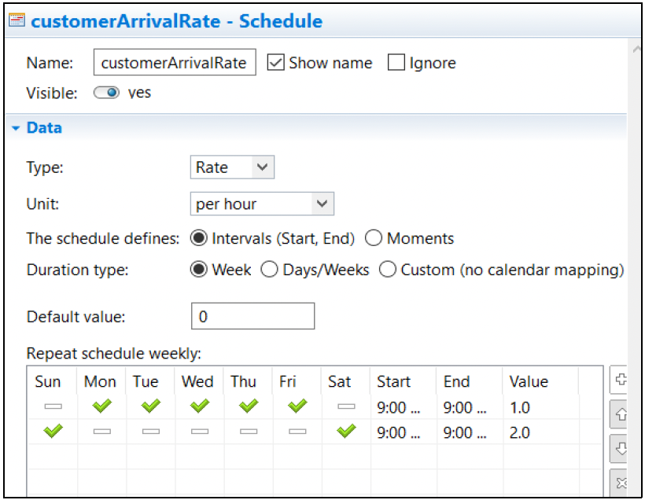

---

### Inventory
- **Initial Value**: 200 products.  
- **Type**: Set as an integer.  

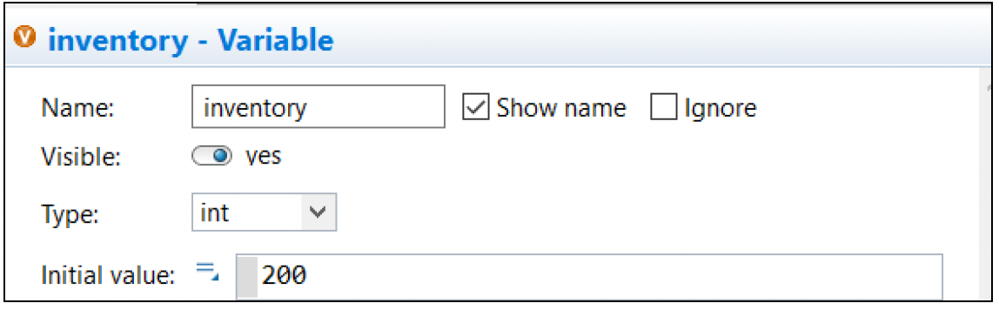

---

### Back Order
- **Description**:  
  When an order from the factory reaches the store, the backordered products are reset to 0.

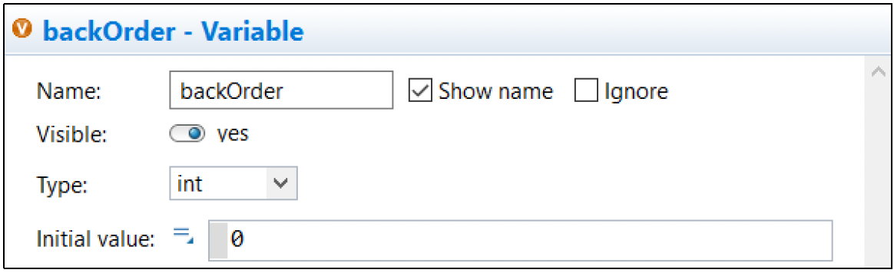

---

### Customer
- **Source**: Customers arrive based on the defined rate schedule.  
- **Arrival Definition**: The `customerArrivalRate` schedule determines the arrival rate.

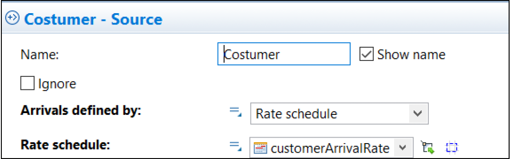

---

### Store Queue
- **Conditions**:  
  1. If stock is 0, the backorder value increases based on the number of customers in the queue; otherwise, 1 product is sold.  
  2. If there are customers in the queue and stock is available, the stock decreases by 1 per customer.  
  3. If the inventory is ≤0, customers wait in the queue (handled by the hold block).  

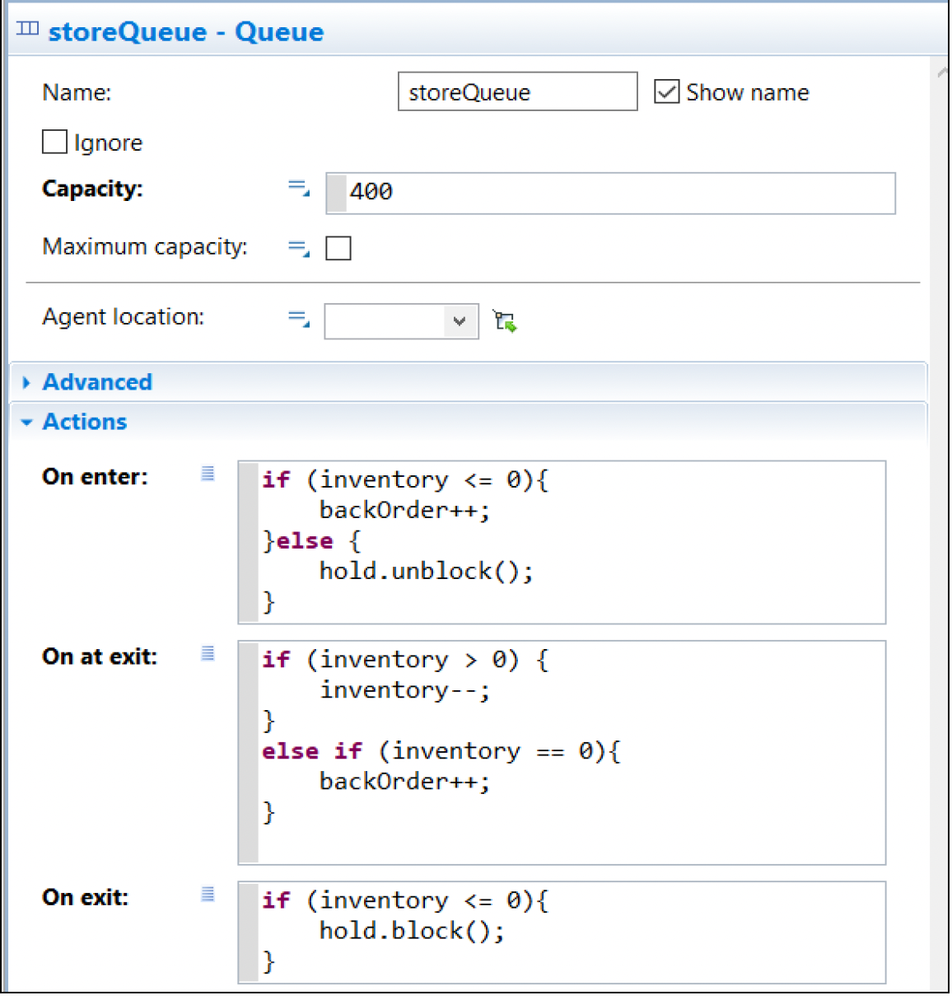

---

### Hold
- **Description**:  
  This block allows customers to wait in the queue if stock is unavailable.

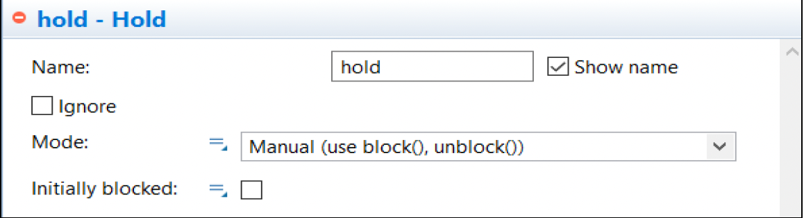

---

### Customer Delay
- **Purpose**:  
  To add realism, varying delay times were introduced for customer shopping.

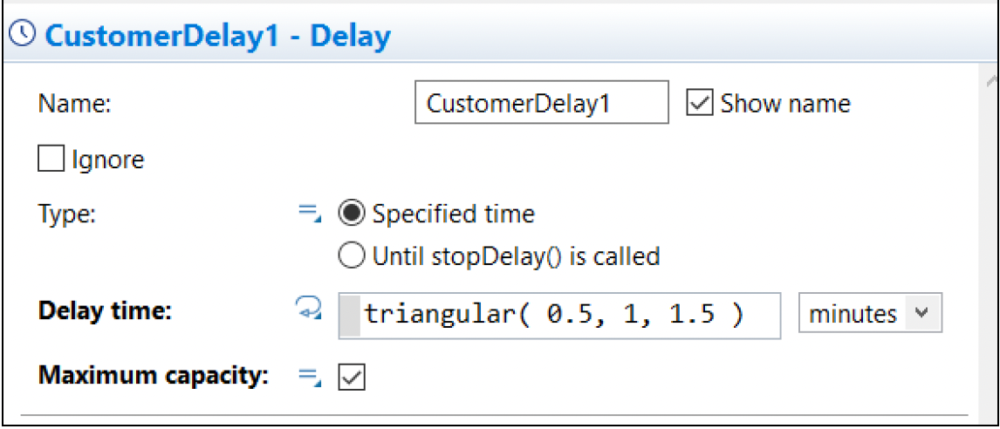

---

### Event
- **Trigger**:  
  Activated when stock falls below 100.  
- **Action**:  
  Initiates production of 200 new products by the factory.

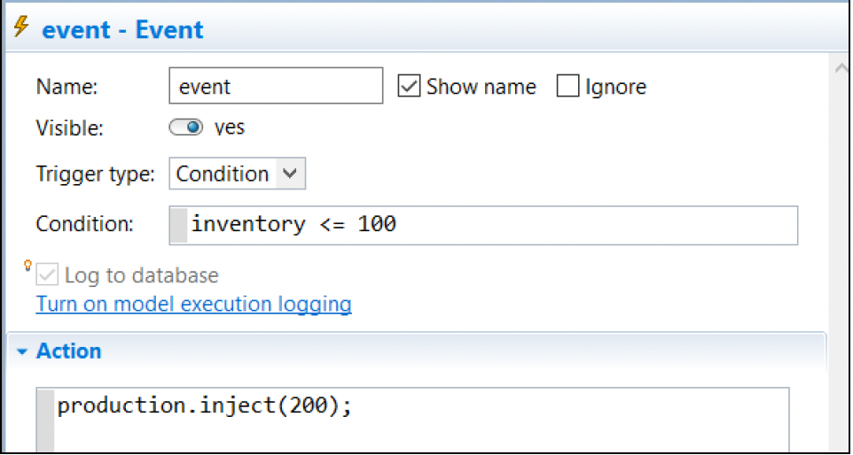

---

### Production
- **Trigger**:  
  When stock is below 100, the production of 200 new products begins.

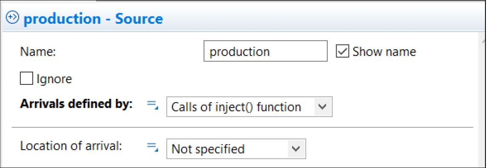

---

### Factory Orders
- **Principle**:  
  Operates on a First-In-First-Out (FIFO) basis.  
- **Realism**: Production occurs sequentially rather than all at once.

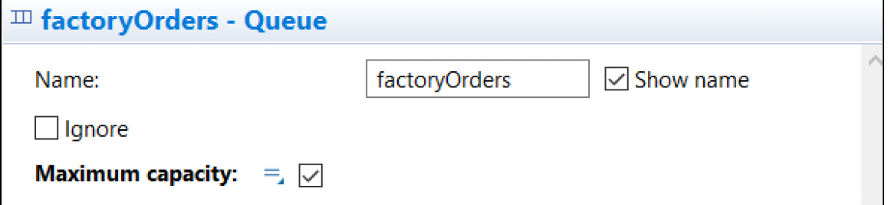

---

### Factory Delay
- **Description**:  
  Simulates realistic production delays with the following times:
  - Minimum: 2.5 days  
  - Mean: 3 days  
  - Maximum: 4 days  
- **Effect**: Inventory increases by 1 for each completed production.

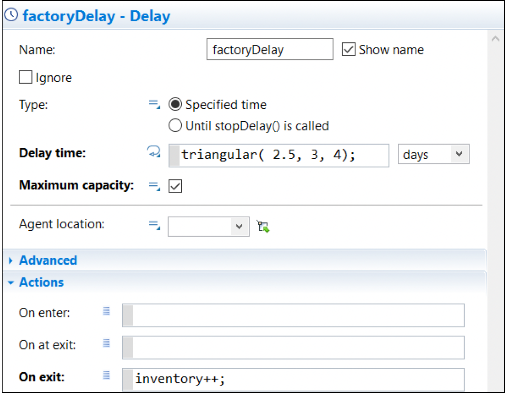

---

### Sink
- **Function**:  
  Once production of 200 products is complete:
  - Backorders are reset to 0.  
  - The event restarts for the next production cycle.

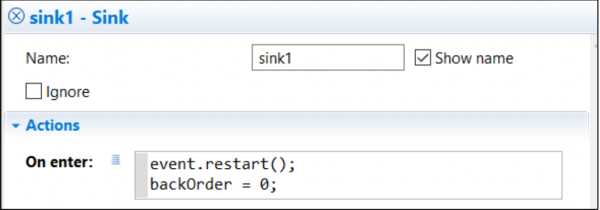

---

### Inventory Chart
- **Time Chart**:  
  Displays changes in the number of products in the store over time.

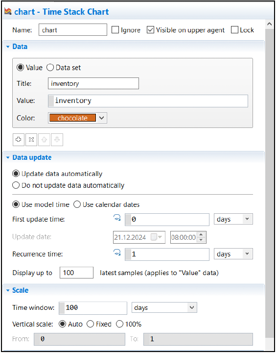

---

### Inventory Bar Chart
- **Bar Chart**:  
  Shows a single column representing the current inventory in the store.

---

## Model Overview

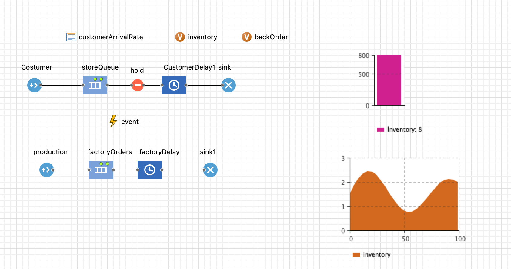

This image provides a schematic representation of the simulated supply chain system in AnyLogic.

## Simulation Overview
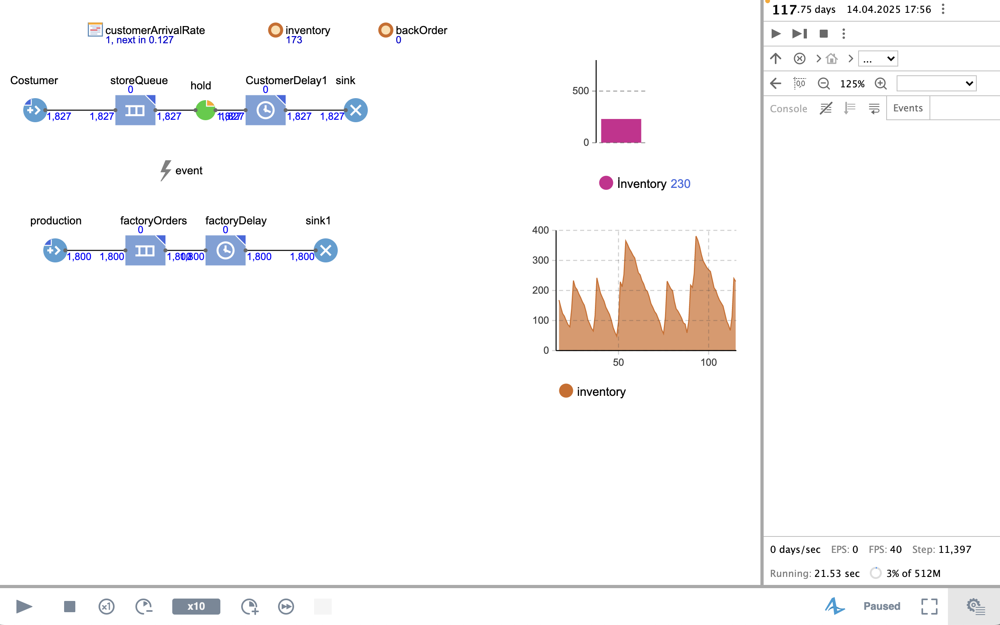

This image captures a running simulation of the supply chain model.

These images demonstrate how the system dynamically balances customer demand, stock levels, and factory production under given constraints.
---
